# SPORTSGD

## Reporte técnico final

**Universidad Tecmilenio**

**Proyecto:**  
SPORTSGD

**Materia:**  
Desarrollo de Aplicaciones Móviles

**Profesor:**  
Jose Luis Suchil Miranda

**Autores:**  
Emiliano Iturralde Velazquez  
Antonio de Jesus Juarez Padilla

**Fecha de entrega:**  
25 de septiembre de 2026

---

> **Instrucción de maquetación.** Esta página corresponde a la portada. No debe agregarse campus, facultad o departamento porque esos datos no aparecen confirmados en los materiales proporcionados. En la versión final se utilizarán Times New Roman de 12 puntos, márgenes de 2.54 cm, interlineado de 1.5 y número de página en la esquina superior derecha, excepto en la portada. Los números del índice se actualizarán después de la última renderización.

<!-- SALTO DE PÁGINA -->

## Criterio de evidencia y alcance del reporte

Este reporte integra cuatro clases de evidencia que no deben confundirse entre sí: el código fuente Android disponible en la carpeta del proyecto; los resultados de compilación, pruebas y análisis estático obtenidos durante la revisión técnica; el prototipo de alta fidelidad en Figma y su exportación a PDF; y los documentos académicos previos `Actividad3_DAM_.pdf` y `SPORTSGD_Reporte_1.1.pdf` (Iturralde Velazquez & Juarez Padilla, 2026a, 2026b). Las pantallas de Figma se presentan como diseño o referencia visual; las imágenes almacenadas en `verification/` se presentan como evidencia real de ejecución disponible en el proyecto. Una imagen del prototipo nunca se utiliza como si fuera una captura de Android.

El análisis de experiencia de usuario distingue entre actividades documentadas y evaluación retrospectiva. Los materiales sí evidencian una arquitectura de información, flujos, fundamentos visuales y componentes organizados con Atomic Design. No se encontró evidencia suficiente para afirmar que se realizaron entrevistas, sesiones formales de observación, pruebas moderadas con usuarios, encuestas o mediciones cuantitativas de usabilidad. Por ello, los perfiles, necesidades y observaciones heurísticas desarrollados en este documento se presentan como análisis técnico posterior, no como resultados de investigación de campo.

La aplicación auditada es un prototipo académico local. Incluye persistencia, navegación y operaciones funcionales dentro del dispositivo, pero no un backend remoto, sincronización entre usuarios, envío real de correo ni notificaciones push productivas. La interfaz de recuperación confirma únicamente que una dirección pertenece al conjunto de cuentas de demostración; no envía un mensaje. Estas restricciones se explican en cada sección pertinente.

**Tabla 1**  
*Criterios para interpretar la evidencia del proyecto*

| Tipo de evidencia | Fuente | Qué permite afirmar | Qué no permite afirmar |
|---|---|---|---|
| Implementación Android | Código Kotlin, XML, recursos y configuración Gradle | Existencia de módulos, flujos, validaciones, persistencia y estructura técnica | Calidad en producción o comportamiento en todos los dispositivos |
| Verificación actual | `testDebugUnitTest`, `lintDebug` y `assembleDebug`, ejecutados durante la revisión final | Compilación del APK, resultado de pruebas unitarias y hallazgos de lint | Cobertura total, ausencia absoluta de defectos o validación humana integral |
| Verificación instrumentada final | Cuatro pruebas ejecutadas el 24 de septiembre de 2026 en `Medium_Phone(AVD) - 17` | Arranque, persistencia de rutina, rechazo de rol inválido y actualización de agenda demo | Cobertura integral de todos los recorridos y dispositivos |
| Prototipo | Archivo Figma y `Figma_Prototipo.pdf` | Intención visual, organización de componentes y estados diseñados | Funciones implementadas o comportamiento real de Android |
| Capturas reales disponibles | Archivos en `verification/` | Apariencia observada durante una ejecución en emulador | Prueba exhaustiva de todos los casos, equipos o versiones del sistema |
| Documentación previa | `Actividad3_DAM_.pdf` y `SPORTSGD_Reporte_1.1.pdf` | Antecedentes, alcance planeado y evolución académica | Estado técnico final si contradice el código auditado |

*Nota.* La fuente principal de verdad técnica es el código final del proyecto. Cuando existe una contradicción, se privilegia la evidencia ejecutable y se describe la diferencia.

<!-- SALTO DE PÁGINA -->

# Índice general

> **Instrucción de maquetación.** Sustituir los marcadores por números reales después de generar la versión final; el índice debe convertirse en un campo actualizable del procesador de texto.

1. Introducción ........................................................................ [página]
2. Objetivos ............................................................................ [página]
   2.1 Objetivo general ............................................................. [página]
   2.2 Objetivos específicos ........................................................ [página]
3. Justificación ........................................................................ [página]
4. Proceso de diseño UX ................................................................. [página]
   4.1 Evidencia disponible y método de análisis ..................................... [página]
   4.2 Usuarios y necesidades ........................................................ [página]
   4.3 Arquitectura de información ................................................... [página]
   4.4 Flujos principales ............................................................ [página]
   4.5 Decisiones de usabilidad y accesibilidad ...................................... [página]
   4.6 Límites de la evaluación UX .................................................... [página]
5. Interfaces y pantallas UI/UX ........................................................ [página]
   5.1 Fundamentos visuales ........................................................... [página]
   5.2 Sistema de componentes y Atomic Design ........................................ [página]
   5.3 Autenticación y recuperación .................................................. [página]
   5.4 Inicio y navegación global ..................................................... [página]
   5.5 Jugadores y calendario ........................................................ [página]
   5.6 Metas y rutinas ............................................................... [página]
   5.7 Concordancia entre prototipo y Android ........................................ [página]
6. Desarrollo de la aplicación en Android .............................................. [página]
   6.1 Entorno de desarrollo .......................................................... [página]
   6.2 Arquitectura real .............................................................. [página]
   6.3 Estructura técnica ............................................................. [página]
   6.4 Librerías y dependencias ....................................................... [página]
   6.5 Navegación ..................................................................... [página]
   6.6 Gestión de datos ............................................................... [página]
   6.7 Funcionalidad por módulo ....................................................... [página]
   6.8 Fragmentos representativos de código .......................................... [página]
   6.9 Evidencia visual de ejecución .................................................. [página]
7. Verificación técnica y resultados ................................................... [página]
   7.1 Estrategia de verificación ..................................................... [página]
   7.2 Resultados reproducibles ....................................................... [página]
   7.3 Cumplimiento de requisitos ..................................................... [página]
8. Conclusiones y trabajo futuro ........................................................ [página]
Anexo A. Repositorio GitHub .............................................................. [página]
Anexo B. Figma .......................................................................... [página]
Referencias .............................................................................. [página]

## Índice de figuras

Figura 1. Fundamentos del sistema visual SPORTSGD ...................................... [página]
Figura 2. Pantalla de acceso en el prototipo ............................................ [página]
Figura 3. Recuperación de acceso en el prototipo ........................................ [página]
Figura 4. Panel principal en el prototipo ............................................... [página]
Figura 5. Menú global en el prototipo .................................................... [página]
Figura 6. Lista de jugadores en el prototipo ............................................ [página]
Figura 7. Calendario de actividades en el prototipo ..................................... [página]
Figura 8. Metas y rutinas en el prototipo ............................................... [página]
Figura 9. Estado de rutina activa en el prototipo ....................................... [página]
Figura 10. Estado de rutina completada en el prototipo .................................. [página]
Figura 11. Acceso ejecutado en Android ................................................... [página]
Figura 12. Panel principal ejecutado en Android .......................................... [página]
Figura 13. Ficha de jugador ejecutada en Android ......................................... [página]
Figura 14. Metas y rutinas ejecutado en Android .......................................... [página]
Figura 15. Alta de rutina ejecutada en Android ........................................... [página]
Figura 16. Selector de jugador ejecutado en Android ...................................... [página]

## Índice de tablas

Tabla 1. Criterios para interpretar la evidencia del proyecto ........................... [página]
Tabla 2. Objetivos específicos y evidencia asociada ...................................... [página]
Tabla 3. Usuarios, necesidades y alcance observado ....................................... [página]
Tabla 4. Arquitectura de información ..................................................... [página]
Tabla 5. Flujos principales y resultado esperado ......................................... [página]
Tabla 6. Paleta y tokens visuales ......................................................... [página]
Tabla 7. Correspondencia de Atomic Design ................................................. [página]
Tabla 8. Módulos del prototipo y estado Android .......................................... [página]
Tabla 9. Configuración técnica del proyecto ............................................... [página]
Tabla 10. Capas y responsabilidades ....................................................... [página]
Tabla 11. Dependencias principales ........................................................ [página]
Tabla 12. Destinos de navegación .......................................................... [página]
Tabla 13. Entidades persistentes .......................................................... [página]
Tabla 14. Implementación funcional por requisito ......................................... [página]
Tabla 15. Resultados de verificación ...................................................... [página]
Tabla 16. Limitaciones y ruta de evolución ................................................ [página]

<!-- SALTO DE PÁGINA -->

# 1. Introducción

SPORTSGD es una aplicación Android académica orientada a la organización de actividades deportivas y al seguimiento básico de jugadores dentro de un contexto universitario. La propuesta reúne en una sola interfaz el acceso por rol, un panel de información, el registro y consulta de jugadores, un calendario de actividades, metas con rutinas, notificaciones internas y un perfil de sesión. Su propósito no es sustituir una plataforma institucional ni un expediente clínico o deportivo profesional, sino demostrar una solución móvil coherente que reduzca la dispersión de información y facilite tareas recurrentes de acompañamiento deportivo.

El problema abordado es principalmente organizativo. Un entrenador necesita consultar y mantener datos de jugadores, identificar actividades próximas, asignar objetivos y revisar el avance de rutinas. Un estudiante necesita entrar a la misma experiencia con permisos acotados, consultar su información y completar las actividades que le corresponden. Cuando estos elementos se gestionan en canales separados, aumenta la posibilidad de omisiones, duplicación o pérdida de contexto. SPORTSGD modela una alternativa centralizada en el dispositivo para explorar esos flujos de forma consistente.

El alcance final se definió a partir de tres fuentes: los requisitos académicos previos, el prototipo de alta fidelidad y el código que realmente puede compilarse y verificarse. Esta triangulación fue necesaria porque los documentos anteriores describían funciones en distintos grados de avance. Por ejemplo, `Actividad3_DAM_.pdf` registraba el acceso y el panel como completos, mientras que el registro, el calendario y las metas aparecían en proceso; el proyecto Android actual ya contiene destinos, interfaces y persistencia local para esos módulos. En sentido contrario, las notificaciones push, el correo de recuperación y la sincronización remota siguen fuera del alcance implementado, aunque existan pantallas o fronteras técnicas que anticipan una integración futura.

La solución fue construida en Kotlin mediante una aplicación Android basada en vistas XML y View Binding. La presentación se distribuye entre una actividad contenedora, fragmentos, adaptadores y ViewModels; el dominio define modelos y contratos; la capa de datos implementa repositorios locales sobre Room; y un contenedor de aplicación realiza la composición manual de dependencias. Jetpack Navigation coordina 16 destinos. La sesión de demostración se mantiene con `SharedPreferences`, mientras que jugadores, actividades, metas, rutinas, pasos y notificaciones se conservan en una base de datos Room.

La validación final separa deliberadamente compilación, pruebas automatizadas, análisis estático y evidencia visual. Una ejecución conjunta de `testDebugUnitTest`, `lintDebug`, `assembleDebug` y `connectedDebugAndroidTest` terminó de manera exitosa en 13 segundos; las cuatro pruebas unitarias y las cuatro instrumentadas finalizaron sin fallos ni errores; lint no reportó errores y sí 128 advertencias; y se generó un APK de depuración de 9,766,942 bytes. Esta distinción impide equiparar “compila” con “está validado para producción”.

El resto del reporte se organiza en objetivos, justificación, proceso UX, sistema de interfaces, desarrollo Android, verificación y conclusiones. Los anexos documentan el repositorio oficial y el archivo Figma. Se excluye deliberadamente cualquier sección de video, conforme al alcance solicitado.

# 2. Objetivos

## 2.1 Objetivo general

Diseñar, desarrollar y validar técnicamente un prototipo funcional de aplicación Android para la gestión deportiva universitaria, denominado SPORTSGD, que integre acceso por rol, información de jugadores, agenda de actividades, metas, rutinas y notificaciones internas mediante una interfaz consistente con el sistema visual definido en Figma y una arquitectura local mantenible.

## 2.2 Objetivos específicos

1. Analizar los requerimientos académicos, el prototipo y la implementación existente para delimitar un alcance comprobable y evitar documentar funciones no desarrolladas.
2. Organizar la experiencia alrededor de los perfiles entrenador y estudiante, con permisos diferenciados para las operaciones de administración.
3. Implementar un flujo de autenticación de demostración, recuperación informativa y control de sesión local.
4. Desarrollar la consulta, alta y detalle de jugadores con información deportiva y académica básica.
5. Integrar un calendario y detalle de actividades con fechas, ubicación, tipo y descripción.
6. Implementar metas y rutinas persistentes, incluyendo pasos, avance y estados de inicio o finalización.
7. Presentar notificaciones internas y navegación coherente entre las secciones principales.
8. Mantener concordancia razonable entre colores, espaciado, jerarquía y componentes del prototipo Figma y la aplicación Android.
9. Verificar el proyecto mediante compilación, pruebas automatizadas disponibles y análisis estático, registrando con precisión el alcance de cada resultado.
10. Preparar documentación técnica reproducible y un repositorio limpio que permitan comprender, clonar y compilar el proyecto.

**Tabla 2**  
*Objetivos específicos y evidencia asociada*

| Objetivo | Evidencia principal | Estado al cierre de la auditoría |
|---|---|---|
| Delimitar requisitos | Matriz entre PDFs, Figma y código | Completado para los módulos revisados |
| Diferenciar roles | `UserRole`, sesión y controles de alta visibles para entrenador | Implementado en el prototipo local |
| Autenticación y sesión | Repositorio local, `SessionManager`, acceso y cierre de sesión | Implementado con credenciales de demostración |
| Jugadores | Lista, formulario, ficha, repositorio y entidad Room | Implementado localmente |
| Calendario | Lista de actividades, ficha de detalle y persistencia | Implementado localmente |
| Metas y rutinas | Entidades, DAOs, repositorio, ViewModels y estados de pantalla | Implementado localmente |
| Notificaciones | Entidad y lista interna con estado de lectura | Implementado sin push remoto |
| Concordancia visual | Tokens Android y comparación con Figma | Parcial: sistema visual alineado; no se incluyeron fuentes personalizadas |
| Verificación | Build, pruebas unitarias, instrumentadas y lint | Completado dentro del alcance descrito |
| Entrega reproducible | README, configuración Gradle y repositorio oficial | Debe confirmarse con el estado final del repositorio antes de exportar el PDF |

*Nota.* “Implementado localmente” significa que la función opera con datos almacenados en el dispositivo o de demostración; no implica un servicio multiusuario en producción.

# 3. Justificación

La administración deportiva universitaria combina información personal, deportiva y académica con actividades programadas y objetivos de entrenamiento. Aunque el alcance de SPORTSGD es académico, el problema que representa es concreto: un seguimiento fragmentado dificulta entender qué debe hacerse, cuándo debe hacerse y qué avance se ha registrado. Reunir las tareas esenciales en una aplicación móvil ofrece una estructura común para entrenador y estudiante, roles que ya están representados en el modelo de sesión y en los permisos de la interfaz.

Para el entrenador, la aplicación concentra la consulta y el alta de jugadores, la revisión de sus datos, el calendario y la creación de metas o rutinas. Para el estudiante, ofrece una vista de consulta y seguimiento con restricciones sobre las operaciones administrativas. El valor no depende de afirmar resultados deportivos que no fueron medidos; reside en la trazabilidad potencial de la información, la reducción de cambios de contexto y la presentación ordenada de tareas relacionadas.

La solución móvil es pertinente porque estos flujos se benefician de acceso frecuente y pantallas breves: revisar la agenda, abrir una ficha, consultar el progreso de una meta o marcar una etapa de una rutina. El diseño usa una barra inferior para cuatro secciones recurrentes —inicio, jugadores, calendario y metas— y accesos globales para menú y notificaciones. Esta organización disminuye la profundidad de navegación para las tareas centrales y mantiene las acciones de sesión en un espacio secundario.

Desde el punto de vista técnico, Kotlin y las bibliotecas AndroidX permiten construir una aplicación nativa con componentes mantenidos para ciclo de vida, navegación y almacenamiento local. La guía de arquitectura de Android recomienda separar responsabilidades y conducir el estado de interfaz desde componentes conscientes del ciclo de vida; SPORTSGD adopta ese principio mediante ViewModels y repositorios, sin afirmar una implementación estricta de Clean Architecture (Android Developers, s. f.-a). Room proporciona una abstracción sobre SQLite, DAOs verificables y consultas observables, apropiadas para el volumen y la naturaleza del prototipo local (Android Developers, s. f.-c).

El almacenamiento local hace viable una demostración sin infraestructura externa, pero también define sus límites. No existe un servidor que unifique cuentas, autorice sesiones de forma remota, sincronice cambios ni distribuya notificaciones. Las credenciales incluidas son datos de demostración visibles en el código y no deben reutilizarse en un despliegue real. De igual forma, la información de jugadores es ficticia y sirve para evaluar la interfaz y las operaciones locales.

La viabilidad se confirmó en términos de construcción: el proyecto usa un wrapper de Gradle versionado, un catálogo central de dependencias y un único módulo `app`; puede compilar un APK de depuración con el entorno auditado. No obstante, viabilidad académica no equivale a preparación para tienda. Antes de una distribución productiva serían necesarios un identificador de aplicación propio —en lugar de `com.example.sportsgd`—, firma de versión, políticas de privacidad, autenticación segura, cifrado y control de acceso del lado servidor, estrategia de migraciones de base de datos y una matriz de pruebas ampliada.

No se utilizan estadísticas externas para exagerar la necesidad o el impacto del proyecto. La justificación se apoya en los flujos observables, la estructura del prototipo y la capacidad técnica demostrada. Este criterio también corrige el reporte previo: cualquier cifra que no cuente con una fuente verificable se omite en lugar de presentarse como evidencia.

# 4. Proceso de diseño UX

## 4.1 Evidencia disponible y método de análisis

Los materiales de Figma documentan fundamentos visuales, identidad, átomos, moléculas, organismos, plantillas, estados y 20 pantallas de alta fidelidad. Esto permite afirmar que existe un trabajo estructurado de diseño de interfaz y que se aplicó una taxonomía compatible con Atomic Design. Los documentos académicos previos también describen el problema, los usuarios generales y una evolución por módulos.

No se encontró un protocolo de entrevistas, transcripciones, cuestionarios, mapa de empatía firmado, registro de pruebas con participantes ni métricas de éxito. En consecuencia, el proceso descrito aquí tiene dos capas. La primera resume los artefactos realmente disponibles. La segunda analiza retrospectivamente el producto mediante tareas, jerarquía, consistencia, prevención de errores y accesibilidad. Esta segunda capa no se presenta como investigación con usuarios.

El método de revisión fue el siguiente:

1. Identificar los roles y tareas que aparecen tanto en el prototipo como en el código.
2. Reconstruir la arquitectura de información a partir de los destinos de navegación y la barra inferior.
3. Comparar estados clave de Figma con layouts y capturas de ejecución Android.
4. Revisar que las acciones críticas muestren confirmación o estado visible.
5. Examinar la consistencia de colores, tipografía, espaciado, radios y componentes.
6. Registrar limitaciones cuando el diseño anticipa un servicio que la aplicación local no implementa.

## 4.2 Usuarios y necesidades

Los dos perfiles sustentados por el código son `COACH` y `STUDENT`. No se les asignan nombres ficticios ni atributos demográficos no documentados. Se describen como perfiles funcionales, equivalentes a proto-personas elaboradas a partir del producto, no como personas validadas mediante investigación.

**Tabla 3**  
*Usuarios, necesidades y alcance observado*

| Perfil funcional | Necesidades inferidas de los flujos | Funciones disponibles | Restricciones observadas |
|---|---|---|---|
| Entrenador | Mantener el registro, consultar fichas, organizar actividades y asignar seguimiento | Alta y consulta de jugadores; calendario; creación de metas y rutinas; notificaciones; perfil y cierre de sesión | Los datos permanecen en un solo dispositivo; no existe consola remota ni colaboración multiusuario |
| Estudiante | Consultar información y avance sin alterar registros administrativos | Acceso, panel, consulta de jugadores/actividad/meta/rutina, notificaciones y perfil | Las acciones de alta se ocultan o rechazan; la sesión no está vinculada a un registro individual de jugador en backend |

*Nota.* Las necesidades son un análisis posterior basado en funciones existentes. No derivan de entrevistas ni pruebas de campo.

Los principales puntos de fricción potenciales identificados en este análisis son: información distribuida entre varias secciones; riesgo de perder el contexto de una actividad; necesidad de distinguir las acciones administrativas de las de consulta; y necesidad de recibir retroalimentación después de registrar o completar una operación. El prototipo responde mediante navegación persistente, tarjetas con resumen, fichas de detalle, estados de éxito y pantallas de rutina activa o completada.

## 4.3 Arquitectura de información

La aplicación comienza en el dominio de acceso. Una sesión válida conduce al panel y habilita la navegación principal. Cuatro secciones permanecen disponibles desde la barra inferior, mientras que menú y notificaciones funcionan como accesos globales. Las pantallas de alta, detalle o confirmación se abren desde su módulo de origen.

**Tabla 4**  
*Arquitectura de información*

| Nivel | Área | Contenido o destinos |
|---|---|---|
| Acceso | Autenticación | Iniciar sesión, recuperar acceso, revisar correo |
| Principal | Inicio | Resumen, actividad próxima y accesos a información relevante |
| Principal | Jugadores | Lista, registro, confirmación de registro y ficha individual |
| Principal | Calendario | Agenda y detalle de actividad |
| Principal | Metas | Metas, alta de meta, alta de rutina, rutina activa y rutina completada |
| Global | Notificaciones | Lista interna, estado leído/no leído y navegación a contenido relacionado |
| Global | Menú | Perfil y cierre de sesión |

Esta estructura coincide con el gráfico de navegación Android, que declara 16 destinos. La navegación principal no se modela como actividades independientes: `MainActivity` aloja un `NavHostFragment` y cada pantalla se implementa como fragmento. Esta decisión conserva una pila común y permite pasar identificadores numéricos a fichas, actividades y rutinas.

## 4.4 Flujos principales

**Tabla 5**  
*Flujos principales y resultado esperado*

| Flujo | Secuencia | Resultado actual |
|---|---|---|
| Inicio de sesión | Acceso → validación local → panel | Sesión persistida localmente para entrenador o estudiante |
| Recuperación | Acceso → formulario de correo → revisar correo | Confirmación visual si la cuenta de demostración es reconocida; no se envía correo real |
| Alta de jugador | Lista → formulario → validación → confirmación → ficha/lista | Registro guardado en Room; acción reservada al entrenador |
| Consulta de actividad | Panel o calendario → detalle | Presentación de título, tipo, horario, ubicación y descripción |
| Meta y rutina | Metas → alta → selección de jugador → rutina → pasos → completar | Estado y progreso persistidos localmente |
| Notificación | Encabezado → lista → elemento relacionado | Consulta y marcado interno de lectura; no existe entrega push |
| Cierre de sesión | Menú → cerrar sesión → acceso | Eliminación de la sesión local y limpieza de la pila de navegación |

El flujo de acceso aplica validaciones de campos vacíos y credenciales. `MainActivity` revisa la sesión al volver a primer plano: si existe sesión y el usuario se encuentra en una pantalla de acceso, lo dirige al panel; si no existe sesión y se intenta mostrar una pantalla protegida, vuelve al inicio de sesión. Esta lógica constituye una barrera de navegación local, no una autorización remota.

En la gestión de jugadores, el formulario recopila nombre, contacto e información deportiva/académica. El resultado se almacena en la base local y se muestra mediante una pantalla de confirmación. La separación entre formulario y confirmación hace visible el estado del sistema después de una acción importante.

El flujo de metas y rutinas distingue el objetivo general del conjunto concreto de pasos. La interfaz muestra progreso y estados, permite iniciar una rutina, actualizar etapas y terminarla. El diseño de Figma contempla pantallas separadas para rutina activa y rutina completada; Android conserva esa diferencia mediante destinos propios.

## 4.5 Decisiones de usabilidad y accesibilidad

La jerarquía se apoya en encabezados, tarjetas y una navegación inferior estable. Los títulos de pantalla indican el contexto, mientras que las acciones primarias se presentan como botones de 48 dp de alto. El sistema de espaciado sigue incrementos de 4, 8, 12, 16, 24 y 32 dp, lo que favorece agrupaciones visuales predecibles. Los radios de 8, 12, 16 y 24 dp se reutilizan en campos, botones y tarjetas.

La consistencia se refuerza mediante estilos XML compartidos para títulos, cuerpo, etiquetas, tarjetas, botones y campos de texto. La aplicación utiliza recursos semánticos para los estados de éxito, advertencia y error. Los mensajes de validación aparecen cerca de los campos o mediante retroalimentación visible; las pantallas de confirmación reducen la ambigüedad después de registrar un jugador o completar una rutina.

El prototipo fue diseñado sobre un marco de 390 × 844 px. Android, en cambio, utiliza unidades independientes de densidad y contenedores que deben adaptarse a otros tamaños. Esta conversión es apropiada: replicar coordenadas fijas de Figma habría reducido la capacidad de adaptación. La revisión visual debe considerar relaciones, jerarquía y proporciones, no una igualdad de píxeles entre herramientas.

Se detectó una consideración de accesibilidad relevante. El contraste aproximado entre texto blanco y el verde primario `#00A991` es 2.96:1. Ese valor puede cumplir para ciertos elementos gráficos o texto grande, pero no alcanza el criterio AA de 4.5:1 para texto normal definido por WCAG 2.2; el verde oscuro `#007F6D` o el verde profundo `#004C41` ofrecen alternativas más seguras para superficies con texto blanco (World Wide Web Consortium [W3C], 2024). Por tanto, el color primario puede mantenerse como identidad y debe reservarse con cautela en botones o encabezados que contengan texto pequeño.

La tipografía del prototipo especifica Iosevka Charon para la marca e Inter para la interfaz. El proyecto Android no empaqueta esas familias: usa `monospace` para la marca y `sans-serif` o `sans-serif-medium` para el contenido. Esta decisión evita una dependencia de fuente ausente, aunque constituye una diferencia visual documentada. Una evolución posterior podría incluir archivos de fuente con licencia confirmada o fuentes descargables con comportamiento de respaldo.

## 4.6 Límites de la evaluación UX

La revisión permite identificar coherencia interna, pero no medir eficacia con usuarios reales. No se calcularon tiempo por tarea, tasa de éxito, errores, System Usability Scale, satisfacción o retención. Tampoco se verificó el comportamiento con TalkBack, escalas de fuente grandes, navegación por teclado, daltonismo o una matriz amplia de dispositivos.

Como trabajo futuro se recomienda realizar pruebas con representantes de ambos roles, definir tareas observables, registrar errores y ajustar la interfaz con base en resultados. Ese estudio debería comenzar por acceso, alta de jugador y finalización de rutina, debido a que combinan validación, permisos y cambio persistente de estado. Las conclusiones de tal estudio no forman parte de este reporte porque no existe evidencia de que haya sido ejecutado.

# 5. Interfaces y pantallas UI/UX

## 5.1 Fundamentos visuales

El archivo Figma organiza la identidad de SPORTSGD antes de presentar las pantallas. Sus páginas de fundamentos, identidad, átomos, moléculas, organismos, plantillas y estados permiten rastrear decisiones comunes en lugar de interpretar cada vista como una composición aislada. La captura seleccionada para la Figura 1 sintetiza esa base sin reproducir las 29 páginas del PDF de prototipo.

**Figura 1**  
*Fundamentos del sistema visual SPORTSGD*

<!-- ARCHIVO DE INSERCIÓN: docs/assets/figma/foundations.png -->

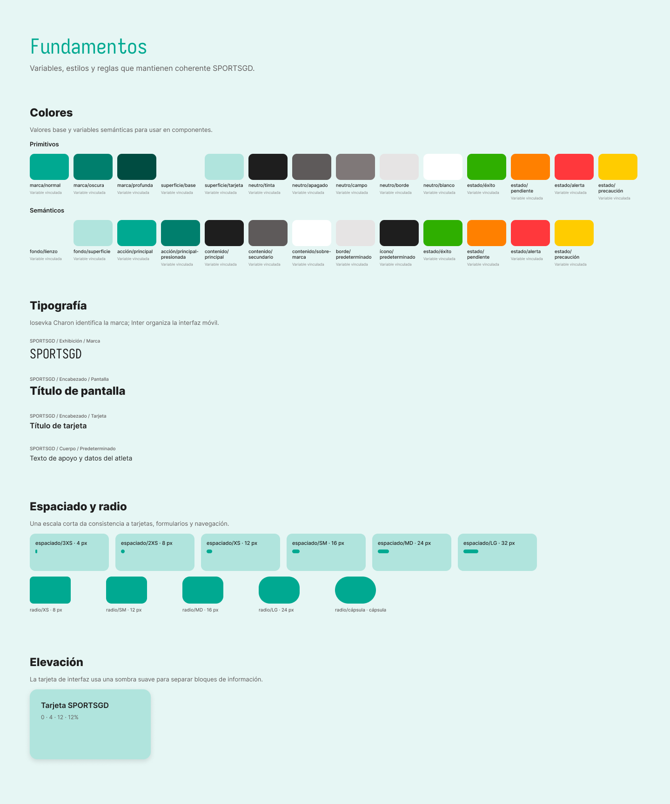

*Nota.* Captura del archivo Figma del proyecto. Presenta tokens y decisiones visuales del prototipo; no corresponde a una pantalla ejecutada en Android. Fuente: Iturralde Velazquez y Juarez Padilla (s. f.-b).

La identidad utiliza verdes como colores principales, fondos de baja saturación y tarjetas que separan información sin depender de elevaciones pronunciadas. El texto principal se mantiene casi negro, el secundario en gris y los estados operativos añaden verde, naranja, rojo y amarillo. La implementación Android conserva estos valores en recursos semánticos, lo que facilita ajustar la paleta sin editar cada layout.

**Tabla 6**  
*Paleta y tokens visuales*

| Función | Valor de Figma | Recurso Android o uso | Observación |
|---|---|---|---|
| Primario | `#00A991` | `sportsgd_primary` | Identidad, acciones y acentos |
| Primario oscuro | `#007F6D` | `sportsgd_primary_dark` | Barra de estado o superficies de mayor contraste |
| Primario profundo | `#004C41` | `sportsgd_primary_deep` | Alternativa de contraste |
| Lienzo | `#E6F6F4` | `sportsgd_canvas` | Fondo general |
| Superficie | `#B0E4DD` | `sportsgd_surface` | Tarjetas y zonas agrupadas |
| Texto principal | `#1E1E1E` | `sportsgd_text_primary` | Títulos y cuerpo principal |
| Texto secundario | `#5E5A5A` | `sportsgd_text_secondary` | Etiquetas y apoyo |
| Texto de entrada | `#7F7878` | `sportsgd_input` | Contenido secundario de campos |
| Borde | `#E6E4E4` | `sportsgd_border` | Campos y tarjetas blancas |
| Éxito | `#2FAF00` | `sportsgd_success` | Confirmaciones |
| Advertencia | `#FF8000` | `sportsgd_warning` | Avisos |
| Error | `#FF383C` | `sportsgd_error` | Validaciones y error |
| Precaución | `#FFCC00` | `sportsgd_caution` | Estado preventivo |
| Espaciado | 4, 8, 12, 16, 24 y 32 | recursos `spacing_*` | Escala reutilizable |
| Radios | 8, 12, 16, 24 | recursos `radius_*` | Campos, botones y tarjetas |

*Nota.* Los nombres Android se tomaron del archivo `app/src/main/res/values/colors.xml`; los valores de Figma proceden de la página de fundamentos del prototipo.

La jerarquía tipográfica del proyecto Android emplea 24 sp para títulos de pantalla, 20 y 16 sp para encabezados de tarjeta, 14 sp para cuerpo y 12, 11 o 10 sp para etiquetas y navegación. Figma especifica Iosevka Charon para la marca e Inter para la interfaz. Android aproxima esa distinción con `monospace` y la familia `sans-serif`, respectivamente; las fuentes propietarias no fueron incorporadas al APK.

## 5.2 Sistema de componentes y Atomic Design

La documentación visual sí sustenta el uso de Atomic Design. La taxonomía propuesta por Frost (2016) no describe una secuencia lineal de construcción, sino niveles que permiten entender cómo elementos básicos se combinan en interfaces mayores. En SPORTSGD, esa correspondencia se observa tanto en Figma como en la reutilización de layouts, estilos y vistas Android.

**Tabla 7**  
*Correspondencia de Atomic Design en SPORTSGD*

| Nivel | Ejemplos en Figma | Correspondencia Android | Alcance comprobado |
|---|---|---|---|
| Átomos | Color, tipografía, icono, etiqueta, divisor | colores, dimensiones, estilos de texto y drawables | Recursos reutilizables |
| Moléculas | Campo con etiqueta y error, botón con icono, indicador de estado | `TextInputLayout`, estilos de botones y fondos de estado | Composición de controles Material |
| Organismos | Encabezado, navegación inferior, tarjeta de jugador o actividad | `view_app_header.xml`, `view_bottom_nav.xml`, layouts `item_*` | Vistas compartidas y adaptadores |
| Plantillas | Estructura con encabezado, contenido y navegación | layouts de fragmentos y `BaseAppFragment` | Patrón consistente entre secciones |
| Páginas | Acceso, panel, jugadores, calendario, metas y rutina | 16 destinos en `nav_graph.xml` | Pantallas con datos y estados reales/locales |

*Nota.* La aplicación no implementa un framework formal llamado “Atomic Design”; utiliza una organización de recursos y vistas coherente con la jerarquía documentada en Figma.

## 5.3 Autenticación y recuperación

La pantalla de acceso prioriza la marca, dos campos y una acción principal. La liga de recuperación se mantiene como acción secundaria. El prototipo incluye además el estado “revisa tu correo”; en la aplicación esta secuencia es informativa, porque el repositorio de autenticación local únicamente valida si el correo corresponde a una cuenta de demostración.

**Figura 2**  
*Pantalla de acceso en el prototipo*

<!-- ARCHIVO DE INSERCIÓN: docs/assets/figma/login.png -->

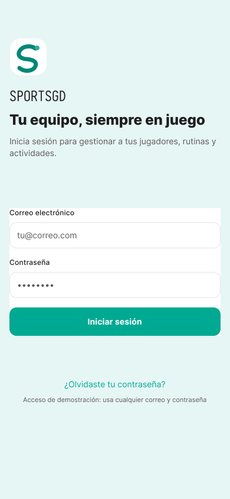

*Nota.* Captura del prototipo de alta fidelidad en Figma. Muestra la intención visual del acceso y no evidencia una sesión ejecutada. Fuente: Iturralde Velazquez y Juarez Padilla (s. f.-b).

**Figura 3**  
*Recuperación de acceso en el prototipo*

<!-- ARCHIVO DE INSERCIÓN: docs/assets/figma/recover-access.png -->

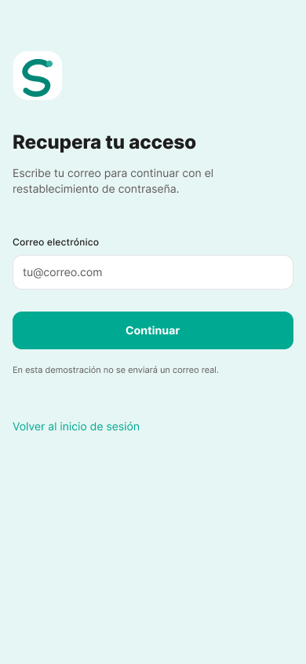

*Nota.* Captura del flujo diseñado para recuperación. En la versión Android auditada no existe un servicio de correo; la confirmación es local y demostrativa. Fuente: Iturralde Velazquez y Juarez Padilla (s. f.-b).

Esta diferencia entre intención y función es deliberadamente visible en el reporte. Implementar el envío real requeriría un proveedor, plantillas, credenciales, manejo de tokens de un solo uso, caducidad y un backend que almacene usuarios de forma segura. No se simula ese servicio ni se afirma que un correo fue enviado.

## 5.4 Inicio y navegación global

El panel principal resume el estado del sistema en tarjetas y accesos a contenido próximo. Su diseño evita presentar todas las operaciones a la vez y sirve como punto de retorno de la navegación. El encabezado ofrece menú y notificaciones; la barra inferior conserva las secciones más frecuentes.

**Figura 4**  
*Panel principal en el prototipo*

<!-- ARCHIVO DE INSERCIÓN: docs/assets/figma/dashboard.png -->

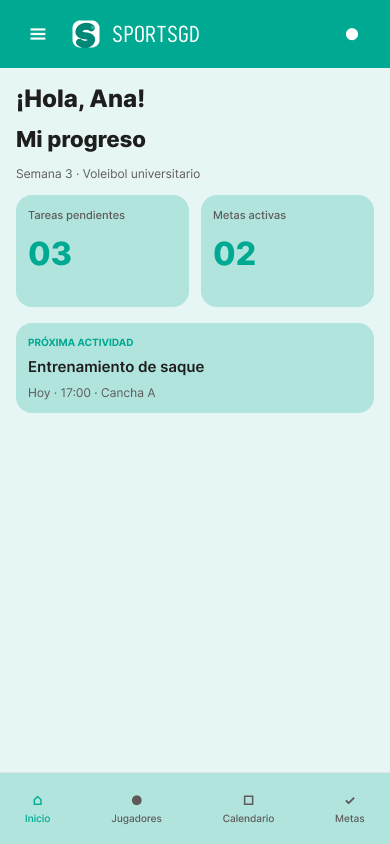

*Nota.* Pantalla diseñada en Figma para el panel principal. Fuente: Iturralde Velazquez y Juarez Padilla (s. f.-b).

**Figura 5**  
*Menú global en el prototipo*

<!-- ARCHIVO DE INSERCIÓN: docs/assets/figma/menu.png -->

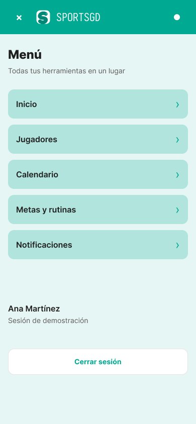

*Nota.* El menú concentra perfil y acciones de sesión fuera de la navegación inferior. Fuente: Iturralde Velazquez y Juarez Padilla (s. f.-b).

La navegación Android replica esta lógica mediante los destinos `dashboardFragment`, `menuFragment` y `notificationsFragment`. `BaseAppFragment` enlaza los botones del encabezado y la barra inferior, evita navegar de nuevo al destino actual y restaura el estado de las secciones principales cuando es posible.

## 5.5 Jugadores y calendario

Jugadores combina una lista resumida, un alta restringida al entrenador y una ficha con datos personales, deportivos y académicos. El formulario verifica nombres, formato de correo, edad o fecha, deporte, posición, equipo, semestre y promedio antes de persistir el registro. La ficha permite leer la información sin volver a exponer los controles del formulario.

**Figura 6**  
*Lista de jugadores en el prototipo*

<!-- ARCHIVO DE INSERCIÓN: docs/assets/figma/players.png -->

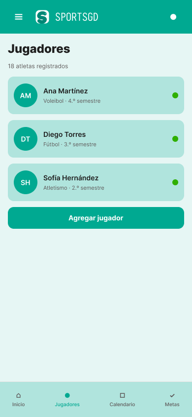

*Nota.* Captura del módulo de jugadores en Figma. Los datos mostrados son de demostración. Fuente: Iturralde Velazquez y Juarez Padilla (s. f.-b).

El calendario presenta actividades próximas y permite abrir un detalle. El modelo local registra título, descripción, tipo, inicio, fin, ubicación y, de forma opcional, un jugador relacionado. La versión actual no sincroniza calendarios externos ni crea recordatorios del sistema.

**Figura 7**  
*Calendario de actividades en el prototipo*

<!-- ARCHIVO DE INSERCIÓN: docs/assets/figma/calendar.png -->

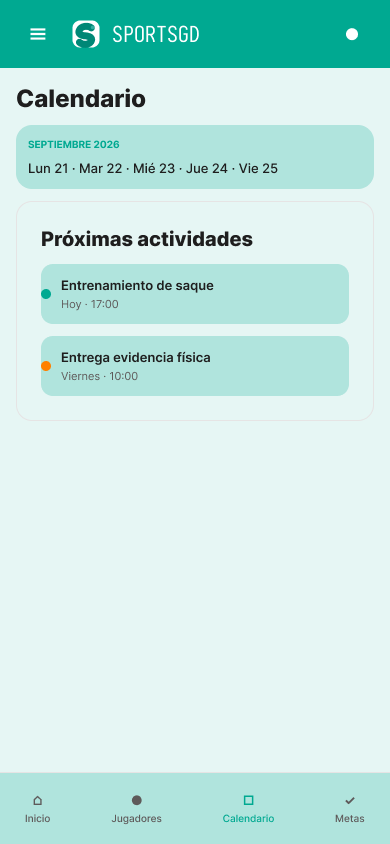

*Nota.* Captura del módulo de calendario en Figma; no implica integración con Google Calendar ni otro proveedor. Fuente: Iturralde Velazquez y Juarez Padilla (s. f.-b).

## 5.6 Metas y rutinas

El módulo distingue una meta medible de una rutina operativa. Una meta tiene jugador, título, descripción, avance, objetivo, unidad y fecha límite opcional. Una rutina tiene jugador, meta relacionada opcional, duración estimada y entre uno y 20 pasos. La interfaz valida que la meta seleccionada corresponda al jugador y calcula el progreso a partir del estado persistido.

**Figura 8**  
*Metas y rutinas en el prototipo*

<!-- ARCHIVO DE INSERCIÓN: docs/assets/figma/goals.png -->

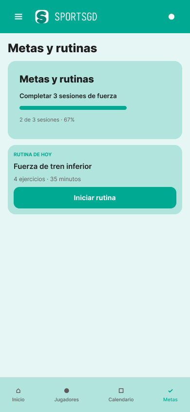

*Nota.* Captura del resumen diseñado en Figma. Fuente: Iturralde Velazquez y Juarez Padilla (s. f.-b).

**Figura 9**  
*Estado de rutina activa en el prototipo*

<!-- ARCHIVO DE INSERCIÓN: docs/assets/figma/routine-active.png -->

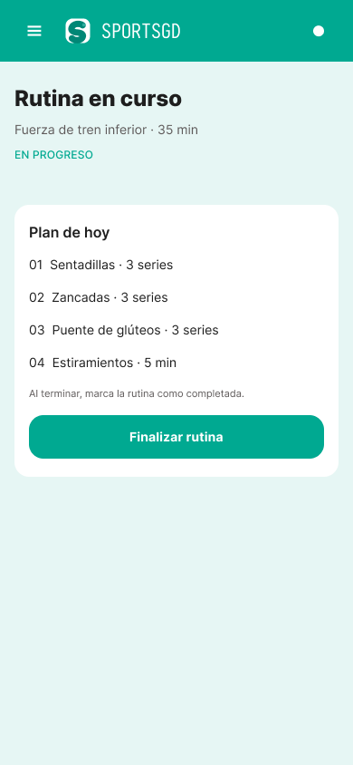

*Nota.* El estado activo enfatiza pasos, avance y acción de finalización. Fuente: Iturralde Velazquez y Juarez Padilla (s. f.-b).

**Figura 10**  
*Estado de rutina completada en el prototipo*

<!-- ARCHIVO DE INSERCIÓN: docs/assets/figma/routine-completed.png -->

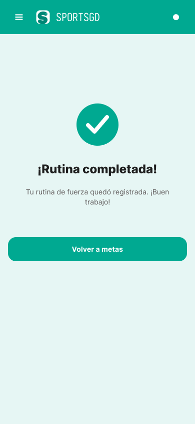

*Nota.* Estado de confirmación diseñado para cerrar el ciclo de una rutina. Fuente: Iturralde Velazquez y Juarez Padilla (s. f.-b).

La finalización Android ocurre en una transacción Room: se completan los pasos, se actualiza la rutina, se incrementa —sin exceder el objetivo— la meta vinculada y se crea una notificación interna. La operación devuelve éxito únicamente cuando el registro existe y puede modificarse. Esta conducta evita mostrar una confirmación si la rutina cambió o ya no está disponible.

## 5.7 Concordancia entre prototipo y Android

La revisión no buscó reproducir coordenadas exactas, sino preservar estructura, jerarquía, estados y lenguaje visual. Android adopta la paleta, la escala de espaciado, radios, tarjetas, botones, campos, encabezado y barra inferior. También implementa las pantallas centrales del prototipo. Las diferencias se registran en la Tabla 8.

**Tabla 8**  
*Módulos del prototipo y estado Android*

| Módulo o estado Figma | Destino o implementación Android | Estado | Diferencia relevante |
|---|---|---|---|
| Acceso | `LoginFragment` | Implementado | Autenticación local con cuentas de demostración |
| Recuperar acceso / revisar correo | `RecoverAccessFragment`, `CheckEmailFragment` | Parcial | No hay envío real de correo |
| Panel | `DashboardFragment` | Implementado | Contenido alimentado por Room local |
| Jugadores | `PlayerListFragment` | Implementado | Acciones de alta condicionadas por rol |
| Registrar jugador / éxito | `PlayerFormFragment`, `PlayerRegisteredFragment` | Implementado | Validaciones adaptadas a Android |
| Ficha de jugador | `PlayerDetailFragment` | Implementado | Datos locales; sin expediente remoto |
| Calendario / entrenamiento | `CalendarFragment`, `ActivityDetailFragment` | Implementado | Sin calendario externo ni alertas del sistema |
| Metas y rutinas | `GoalsFragment` | Implementado | Alta y seguimiento locales |
| Rutina activa / completada | `RoutineActiveFragment`, `RoutineCompletedFragment` | Implementado | Persistencia transaccional local |
| Notificaciones | `NotificationsFragment` | Implementado parcialmente | Bandeja interna; no push remoto |
| Menú y perfil | `MenuFragment`, `ProfileFragment` | Implementado | Perfil derivado de la sesión de demostración |
| Evidencia deportiva | Referencia mediante actividad/notificación | No implementado como carga de archivo | No hay selección, subida o almacenamiento de evidencia multimedia |

*Nota.* “Parcial” indica que la pantalla o frontera existe, pero depende de un servicio externo no configurado. No se incluyen estados de Figma que sean variaciones visuales de la misma función como módulos independientes.

# 6. Desarrollo de la aplicación en Android

## 6.1 Entorno de desarrollo

La configuración técnica se obtuvo directamente de los scripts Gradle del proyecto, no de versiones históricas citadas en documentos anteriores.

**Tabla 9**  
*Configuración técnica del proyecto*

| Elemento | Valor verificado |
|---|---|
| Proyecto | SPORTSGD |
| Módulos | Un módulo Android `app` |
| Lenguaje | Kotlin |
| Interfaz | XML, Material Components y View Binding |
| Gradle Wrapper | 9.5.0 |
| Android Gradle Plugin | 9.3.3 |
| KSP | 2.3.10 |
| `compileSdk` | 37 |
| `targetSdk` | 37 |
| `minSdk` | 24 |
| Compatibilidad Java | 11 |
| `namespace` | `com.example.sportsgd` |
| `applicationId` | `com.example.sportsgd` |
| Código de versión | 1 |
| Nombre de versión | 1.0 |
| Base de datos | Room, versión 1, con esquema exportado |

*Nota.* Los valores se obtuvieron del código fuente auditado (Iturralde Velazquez & Juarez Padilla, 2026c). `com.example.sportsgd` es adecuado para un prototipo académico, pero debe sustituirse por un identificador controlado por el equipo antes de publicar la aplicación.

El proyecto usa un catálogo `gradle/libs.versions.toml` para centralizar versiones y el wrapper incluye una suma SHA-256 para validar la distribución de Gradle. Los repositorios de dependencias están limitados a Google, Maven Central y Gradle Plugin Portal según el tipo de artefacto.

## 6.2 Arquitectura real

SPORTSGD utiliza una arquitectura por capas con presentación inspirada en MVVM. No se describe como Clean Architecture estricta porque las capas se mantienen dentro del mismo módulo, la inyección es manual y algunas decisiones de navegación residen en fragmentos. Sin embargo, sí existe una separación clara de responsabilidades:

- La presentación contiene fragmentos, adaptadores, formateadores y ViewModels.
- El dominio contiene modelos, contratos de repositorio y la frontera para notificaciones push futuras.
- Datos contiene Room, DAOs, entidades, mapeadores, sesión y repositorios locales.
- `AppContainer` crea las dependencias y las comparte desde `SportsGdApplication`.

Los ViewModels exponen `StateFlow` o estados sellados, ejecutan trabajo asíncrono con `viewModelScope` y validan entradas antes de llamar a repositorios. Los fragmentos observan esos estados en el ciclo de vida `STARTED` y se ocupan de enlazar controles, presentar errores y navegar. Los repositorios aíslan Room y permiten que la presentación trabaje con modelos de dominio.

**Tabla 10**  
*Capas y responsabilidades*

| Capa | Paquetes o clases | Responsabilidad |
|---|---|---|
| Aplicación | `SportsGdApplication`, `AppContainer` | Crear base, sesión y repositorios; iniciar datos de demostración |
| Presentación | `presentation.fragments`, `presentation.viewmodels`, `presentation.adapters` | Renderizar estado, validar interacción y coordinar navegación |
| Dominio | `domain.model`, `domain.repository`, `domain.notification` | Definir modelos y contratos independientes del detalle Room |
| Datos | `data.local`, `data.repository`, `data.mapper`, `data.session` | Persistir, consultar, mapear y mantener sesión local |
| Recursos | `res/layout`, `res/navigation`, `res/values`, `res/drawable` | Estructura visual, textos, estilos, navegación e iconografía |

La composición manual resulta suficiente para el tamaño actual y hace explícito qué repositorio recibe cada ViewModel. Si el proyecto creciera, un contenedor de inyección podría reducir código de fábrica; esa sustitución no es necesaria para demostrar la arquitectura presente.

## 6.3 Estructura técnica

`MainActivity` infla un único layout con View Binding y aloja el `NavHostFragment`. En `onResume` compara el destino actual con la sesión: redirige desde acceso hacia panel cuando el usuario ya está autenticado y protege los destinos internos cuando la sesión no existe. Los fragmentos que pertenecen a la aplicación heredan de `BaseAppFragment`, encargado del encabezado, menú, notificaciones y navegación inferior.

La capa de presentación incluye ViewModels especializados para acceso, panel, jugadores, calendario, detalle de actividad, metas/rutinas, notificaciones y detalle de jugador. Los adaptadores de `RecyclerView` presentan actividades, jugadores, notificaciones y pasos de rutina. El uso de View Binding evita búsquedas manuales de vistas para la mayor parte de la interfaz y reduce referencias inseguras.

La capa de datos define seis entidades Room y sus DAOs. Los mapeadores transforman entidades de persistencia en modelos del dominio. `DatabaseSeeder` inserta un conjunto de demostración de jugadores, actividades, una meta, una rutina con cuatro pasos y notificaciones. También renueva únicamente la fecha de las actividades demo que ya vencieron y repara la asociación del entrenamiento con la jugadora Ana, sin modificar actividades creadas fuera del conjunto semilla. Los repositorios esperan a que termine esta inicialización antes de emitir los flujos iniciales.

## 6.4 Librerías y dependencias

**Tabla 11**  
*Dependencias principales*

| Dependencia | Versión | Uso en SPORTSGD |
|---|---:|---|
| AndroidX Core KTX | 1.19.0 | Extensiones base de Android y Kotlin |
| AppCompat | 1.8.0 | Compatibilidad de actividad, tema y widgets |
| Material Components | 1.14.0 | Botones, campos, tarjetas, mensajes y tema Material 3 |
| Activity KTX | 1.13.0 | Integración de actividad y ciclo de vida |
| Fragment KTX | 1.8.9 | Fragmentos y delegados de ViewModel |
| ConstraintLayout | 2.2.2 | Composición adaptable de layouts |
| Lifecycle | 2.10.0 | ViewModel, LiveData/runtime y observación por ciclo de vida |
| RecyclerView | 1.4.0 | Listas de jugadores, actividades, notificaciones y pasos |
| Navigation Fragment/UI KTX | 2.10.1 | Gráfico, destinos y navegación entre fragmentos |
| Room runtime/KTX/compiler | 2.8.5 | Base local, DAOs, flujos y generación KSP |
| Kotlin Coroutines Android | 1.10.2 | Operaciones asíncronas y `StateFlow` |
| JUnit | 4.13.2 | Pruebas unitarias JVM |
| AndroidX Test JUnit | 1.3.0 | Pruebas instrumentadas |
| Espresso Core | 3.7.0 | Interacción/verificación de interfaz instrumentada |

*Nota.* Las versiones proceden de `gradle/libs.versions.toml`. No se documentan bibliotecas ausentes, como Retrofit, Firebase o Hilt.

## 6.5 Navegación

Jetpack Navigation centraliza los destinos en `nav_graph.xml` (Android Developers, s. f.-b). Los identificadores de jugador, actividad y rutina se transmiten como argumentos `long`; un valor predeterminado de `-1L` representa un argumento inválido y las pantallas de detalle manejan la ausencia del registro.

**Tabla 12**  
*Destinos de navegación*

| Área | Destinos declarados |
|---|---|
| Acceso | `loginFragment`, `recoverAccessFragment`, `checkEmailFragment` |
| Inicio | `dashboardFragment` |
| Jugadores | `playerListFragment`, `playerFormFragment`, `playerRegisteredFragment`, `playerDetailFragment` |
| Actividades | `calendarFragment`, `activityDetailFragment` |
| Metas y rutinas | `goalsFragment`, `routineActiveFragment`, `routineCompletedFragment` |
| Global | `notificationsFragment`, `menuFragment`, `profileFragment` |

Las secciones principales usan navegación de nivel superior con restauración de estado. Las pantallas de confirmación o detalle conservan una relación contextual con el origen y ofrecen retorno. Al cerrar sesión se limpia la pila para impedir volver a una pantalla protegida mediante el botón Atrás.

## 6.6 Gestión de datos

La base `sportsgd.db` usa Room versión 1 y seis entidades. Su esquema se exporta a `app/schemas/com.example.sportsgd.data.local.SportsGdDatabase/1.json`, lo que establece una línea base para futuras migraciones. `RoomConverters` transforma enumeraciones y tipos que SQLite no almacena directamente. Los repositorios observan DAOs mediante `Flow`, lo que permite actualizar listas cuando cambia la base sin recargar manualmente toda la pantalla.

**Tabla 13**  
*Entidades persistentes*

| Entidad | Datos principales | Relación relevante |
|---|---|---|
| `PlayerEntity` | identidad, contacto, deporte, posición, equipo, semestre, promedio y estado | Referencia desde metas, rutinas y actividad opcional |
| `ActivityEntity` | título, descripción, tipo, inicio, fin y ubicación | Jugador opcional |
| `GoalEntity` | título, avance, objetivo, unidad, fecha límite y estado | Pertenece a un jugador |
| `RoutineEntity` | título, descripción, duración, inicio y finalización | Pertenece a jugador y puede vincular meta |
| `RoutineStepEntity` | orden, título, descripción, duración y finalización | Pertenece a rutina |
| `AppNotificationEntity` | título, mensaje, tipo, fecha, lectura y destino | Puede conducir a actividad, meta o rutina |

La sesión se almacena por separado mediante `SharedPreferences` y se expone como `StateFlow<AuthSession?>`. Este almacenamiento solo representa el inicio de sesión local. No guarda un token emitido por servidor, no renueva credenciales y no autoriza peticiones remotas. Los datos sensibles de una solución productiva no deberían confiar exclusivamente en este mecanismo.

Las operaciones que afectan varias tablas utilizan transacciones. Al guardar una rutina se almacena la cabecera y se reemplaza su conjunto de pasos. Al completarla se modifican rutina, pasos, meta y notificación en una misma transacción. Este diseño reduce estados parciales si una operación falla.

## 6.7 Funcionalidad por módulo

**Tabla 14**  
*Implementación funcional por requisito*

| Requisito | Implementación comprobada | Alcance o condición |
|---|---|---|
| Inicio de sesión | Validación de campos, dos cuentas demo, sesión persistente y redirección | No es autenticación remota |
| Recuperación | Validación de correo reconocido y pantalla de confirmación | No envía correo ni restablece contraseña |
| Panel | Resumen y contenido próximo obtenido de repositorios locales | Datos de demostración o creados localmente |
| Registro de jugadores | Formulario, validaciones, permiso de entrenador, guardado y confirmación | No valida duplicidad contra servidor |
| Ficha personal/deportiva | Nombre, contacto, deporte, posición, equipo, semestre, promedio y estado | No es expediente oficial |
| Calendario | Actividades ordenadas y ficha de detalle | No sincroniza proveedores externos |
| Metas | Consulta, creación, progreso y vinculación a jugador | Administración reservada al entrenador |
| Rutinas | Creación, pasos, inicio, actualización, finalización y reinicio previo a completar | Persistencia local transaccional |
| Notificaciones | Bandeja interna, conteo y marcado de lectura | Sin servicio push |
| Permisos por rol | Controles ocultos y comprobación en ViewModels para altas | Control local; un backend deberá repetir autorización |
| Evidencia física | Mensaje/actividad de demostración | No hay carga de archivos |
| Perfil y sesión | Datos de la sesión y cierre con limpieza de navegación | Perfil no editable y sin servidor |

Las validaciones más completas se concentran en altas. El registro de jugador exige nombre y apellido de al menos dos caracteres, correo con formato válido, edad entre 12 y 100 años o fecha válida, semestre entre 1 y 12 y promedio entre 0 y 10. La meta limita objetivo y avance; la rutina limita duración, cantidad de pasos y longitud de cada paso. Los resultados se modelan como estados sellados de guardado, éxito, entrada inválida o fallo.

## 6.8 Fragmentos representativos de código

El primer fragmento muestra la composición manual de repositorios. Las dependencias se construyen una vez y se inyectan en los ViewModels mediante una fábrica; no se recurre a variables globales de datos.

```kotlin
val database: SportsGdDatabase = SportsGdDatabase.create(context)
val sessionManager = SessionManager(context)

val authRepository: AuthRepository = LocalAuthRepository(sessionManager)
val playerRepository: PlayerRepository = LocalPlayerRepository(
    playerDao = database.playerDao(),
    awaitSeed = awaitSeed,
)
```

*Nota.* Extracto de `app/src/main/java/com/example/sportsgd/AppContainer.kt`. Se eliminaron líneas no necesarias para centrar la explicación.

El siguiente fragmento ejemplifica la validación de permisos en la capa de presentación. Ocultar un botón no es suficiente; el ViewModel también rechaza la operación cuando la sesión no corresponde a entrenador.

```kotlin
if (authRepository.session.value?.role != UserRole.COACH) {
    mutableSaveResult.value = PlayerSaveResult.Failure(
        "Solo un entrenador puede registrar jugadores."
    )
    return
}
```

*Nota.* Extracto de `PlayersViewModel.kt`. El control sigue siendo local y debe replicarse en servidor en una solución productiva.

Por último, la finalización de rutina se ejecuta dentro de una transacción y solo retorna éxito si la actualización principal afectó el registro esperado.

```kotlin
return database.withTransaction {
    val routine = routineDao.getByIdWithSteps(routineId)
        ?: return@withTransaction false
    if (routine.routine.isCompleted) return@withTransaction false
    routineStepDao.completeAll(routineId, completedAt)
    if (routineDao.updateCompletion(routineId, true, completedAt) == 0) {
        return@withTransaction false
    }
    incrementLinkedGoal(routine.routine.goalId)
    addCompletionNotification(routineId, routine.routine.title,
        routine.routine.goalId, completedAt)
    true
}
```

*Nota.* Extracto condensado de `LocalRoutineRepository.kt`. Los nombres conservan su significado original; el formato se ajustó para el reporte.

## 6.9 Evidencia visual de ejecución

Las siguientes figuras se obtienen de archivos existentes en `verification/`. Se etiquetan explícitamente como capturas reales de ejecución disponibles en el proyecto y no sustituyen pruebas automatizadas. Las Figuras 12, 13, 15 y 16 se recapturaron después de las correcciones finales; las restantes son evidencias reales previas conservadas en el proyecto.

**Figura 11**  
*Acceso ejecutado en Android*

<!-- ARCHIVO DE INSERCIÓN: verification/login-final.png -->

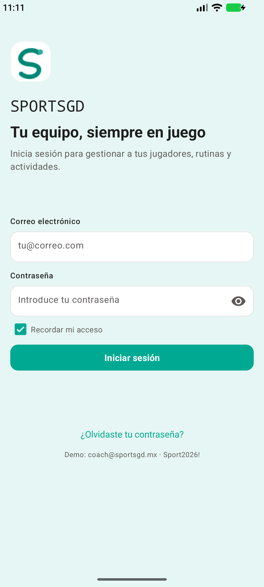

*Nota.* Captura real de ejecución almacenada en el proyecto. No corresponde a una pantalla exportada desde Figma.

**Figura 12**  
*Panel principal ejecutado en Android*

<!-- ARCHIVO DE INSERCIÓN: verification/final-dashboard.png -->

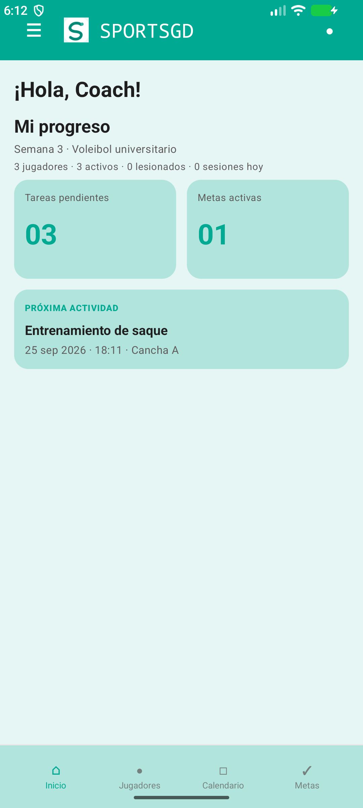

*Nota.* Captura real final del panel en emulador Android. Muestra la agenda de demostración vigente y la actividad próxima calculada desde Room.

**Figura 13**  
*Ficha de jugador ejecutada en Android*

<!-- ARCHIVO DE INSERCIÓN: verification/final-player-detail.png -->

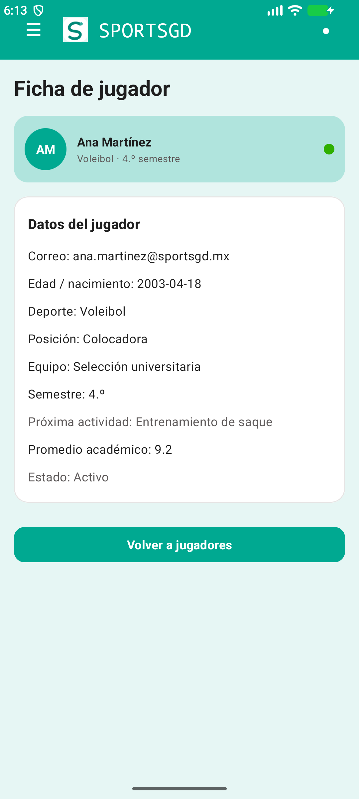

*Nota.* Captura real final de la ficha de Ana Martínez. La actividad de entrenamiento semilla aparece asociada al jugador y se presenta como próxima actividad.

**Figura 14**  
*Metas y rutinas ejecutado en Android*

<!-- ARCHIVO DE INSERCIÓN: verification/goals.png -->

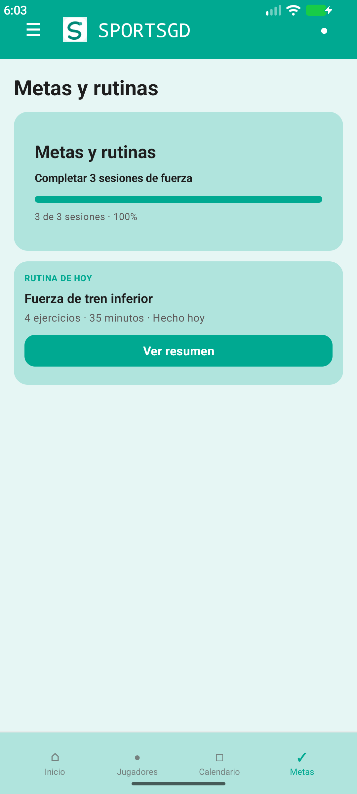

*Nota.* Captura real disponible del módulo de metas y rutinas.

**Figura 15**  
*Alta de rutina ejecutada en Android*

<!-- ARCHIVO DE INSERCIÓN: verification/final-routine-dialog.png -->

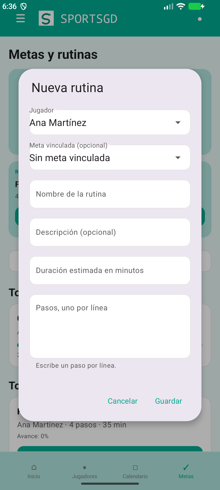

*Nota.* Captura real final del formulario de alta. La indicación para los pasos se muestra como texto de ayuda Material, sin superponerse con la etiqueta del campo.

**Figura 16**  
*Selector de jugador ejecutado en Android*

<!-- ARCHIVO DE INSERCIÓN: verification/final-routine-dropdown.png -->

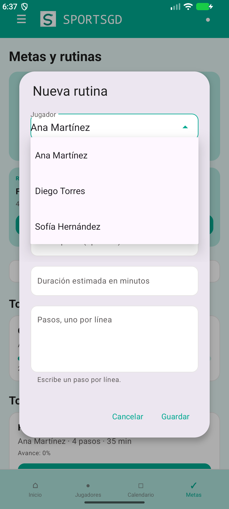

*Nota.* Captura real disponible del selector en el flujo de rutina. El nombre se presenta como etiqueta breve para evitar envoltura innecesaria.

# 7. Verificación técnica y resultados

## 7.1 Estrategia de verificación

La verificación se organizó en capas para que cada resultado conserve un significado preciso:

1. **Inspección estática:** revisión de Gradle, manifiesto, gráfico de navegación, código Kotlin, XML, recursos, persistencia y manejo de sesión.
2. **Pruebas unitarias JVM:** verificación rápida de reglas puras del dominio y del contrato de destinos.
3. **Análisis lint:** detección de problemas de Android, accesibilidad, compatibilidad y calidad de recursos.
4. **Compilación del APK:** comprobación de que código, recursos, generación KSP y empaquetado son compatibles.
5. **Pruebas instrumentadas:** comprobaciones que requieren Android para arranque, persistencia, sesión y actualización de datos semilla.
6. **Evidencia visual:** capturas de emulador conservadas en el proyecto, utilizadas para observar el aspecto de flujos representativos.

La orden conjunta reproducible utilizada para la verificación automatizada principal fue:

```powershell
./gradlew.bat :app:testDebugUnitTest :app:lintDebug :app:assembleDebug :app:connectedDebugAndroidTest --stacktrace
```

En Windows, la ejecución auditada utilizó el runtime Java incluido con Android Studio y un directorio de usuario de Gradle fuera del repositorio. Esos valores son propios del entorno local y no deben fijarse dentro del código versionado.

## 7.2 Resultados reproducibles

**Tabla 15**  
*Resultados de verificación*

| Verificación | Resultado registrado | Interpretación correcta |
|---|---|---|
| `:app:testDebugUnitTest` | Exitoso; 4 pruebas aprobadas | Las reglas unitarias cubiertas se comportaron como se esperaba |
| `:app:lintDebug` | Exitoso; 0 errores y 128 advertencias | No hubo bloqueos de lint; las advertencias no equivalen a defectos corregidos ni a riesgo cero |
| `:app:assembleDebug` | Exitoso | El proyecto produjo un APK de depuración |
| Ejecución Gradle conjunta | `BUILD SUCCESSFUL` en 13 s; 86 tareas (5 ejecutadas y 81 actualizadas) | Compatibilidad del código y recursos en el entorno auditado |
| APK | `app/build/outputs/apk/debug/app-debug.apk`, 9,766,942 bytes; SHA-256 `d09933bef9d563bf7311c54764ac8eb3e6fcf9e61c6dbee1c75bcc6d5e280754` | Artefacto depurable; no es un paquete firmado para distribución |
| `:app:connectedDebugAndroidTest` | Exitoso; 4 de 4 pruebas, 0 fallos y 0 errores | Suite ejecutada en `Medium_Phone(AVD) - 17` |
| Prueba instrumentada de arranque | Aprobada el 24 de septiembre de 2026 | `MainActivity` inició y el gráfico se infló |
| Prueba instrumentada de rutina | Aprobada el 24 de septiembre de 2026 | La finalización actualizó Room exactamente una vez |
| Prueba instrumentada de sesión | Aprobada el 24 de septiembre de 2026 | Un rol desconocido cerró la sesión y eliminó su persistencia |
| Prueba instrumentada de datos demo | Aprobada el 24 de septiembre de 2026 | La agenda vencida se renovó y el entrenamiento conservó su jugadora asignada |
| Capturas de emulador | Disponibles en `verification/` | Evidencia visual de ciertos estados; no prueba todos los flujos |

*Nota.* La ejecución se realizó el 24 de septiembre de 2026 en hora local de Ciudad de México; algunos archivos XML registran el 25 de septiembre debido a su marca de tiempo en UTC. El reporte HTML y los XML generados por Gradle conservan el detalle del dispositivo y de cada clase de prueba.

Las cuatro pruebas unitarias verifican: que el gráfico declare todos los destinos requeridos; que el progreso de una meta se calcule y limite correctamente; que el progreso de una rutina refleje sus pasos; y que el nombre completo de un jugador ignore componentes vacíos. Es una base útil, pero pequeña respecto al tamaño del proyecto. No existe una cobertura automatizada completa para cada formulario, ruta de navegación, consulta DAO o estado de error.

La auditoría también produjo correcciones preventivas. Una sesión incompleta o alterada ya no obtiene privilegios de entrenador por un valor predeterminado: se invalida y se elimina. Las reglas de respaldo excluyen tanto la preferencia de sesión como la base de datos local, lo que evita copiar automáticamente los datos de demostración o cualquier dato capturado a la nube o a una transferencia de dispositivo (Android Developers, s. f.-d). Las mutaciones de rutina devuelven un resultado booleano y la interfaz solo confirma éxito cuando Room modificó la fila esperada.

El análisis lint generó advertencias no bloqueantes. Su conteo se informa completo para no presentar “cero errores” como “cero observaciones”. La depuración de advertencias debe priorizar accesibilidad, APIs obsoletas y recursos antes de una publicación; no conviene realizar cambios masivos de estilo sin una revisión funcional posterior.

## 7.3 Cumplimiento de requisitos

La matriz siguiente actualiza el estado histórico de `Actividad3_DAM_.pdf`. En aquel documento, acceso y panel se reportaban completos; registro, calendario y metas permanecían en progreso; y push/evidencia quedaban pendientes. El código final revisado amplía los primeros módulos, pero no convierte dependencias externas en funciones productivas.

### Requisitos completados en el prototipo local

- Estructura Android en Kotlin con un módulo compilable.
- Pantalla de acceso, validación de credenciales de demostración y sesión local.
- Panel principal y navegación por las cuatro secciones centrales.
- Lista, alta, confirmación y ficha de jugadores.
- Datos deportivos y académicos básicos: deporte, posición, equipo, semestre y promedio.
- Calendario y detalle de actividades locales.
- Metas, creación de rutinas, pasos, progreso y estados activo/completado.
- Notificaciones internas con estado de lectura.
- Menú, perfil y cierre de sesión.
- Permisos locales diferenciados entre entrenador y estudiante para acciones de alta.
- Persistencia Room y actualización reactiva de listas.
- Sistema visual alineado con los tokens principales de Figma.
- Build de depuración, pruebas unitarias y lint ejecutados con resultados documentados.
- Exclusión de archivos generados, configuración local, llaves y secretos mediante `.gitignore`.

### Requisitos parcialmente completados

- **Recuperación de acceso:** existen formulario, validación y confirmación, pero no correo real ni token de restablecimiento.
- **Notificaciones:** existe una bandeja interna y una frontera `PushNotificationGateway`, pero no se configuró Firebase Cloud Messaging ni otro proveedor.
- **Perfil estudiante:** el rol existe y limita operaciones; la cuenta no está asociada de forma segura a una fila individual de jugador mediante servidor.
- **Concordancia tipográfica:** jerarquía y estilo se preservan, pero Android utiliza familias del sistema en lugar de Iosevka Charon e Inter.
- **Verificación de interfaz:** hay capturas y cuatro pruebas instrumentadas finales, pero la suite todavía no recorre todos los formularios y rutas como pruebas end-to-end.
- **Accesibilidad:** se identificaron contrastes y se usan tamaños táctiles definidos, pero no se ejecutó una auditoría completa con tecnologías de asistencia.

### Requisitos no implementados por depender de alcance o infraestructura ausente

- Backend remoto, sincronización multiusuario y resolución de conflictos.
- Autenticación productiva, restablecimiento seguro de contraseña y gestión de cuentas.
- Envío de correo real.
- Distribución de notificaciones push.
- Carga, almacenamiento y revisión de archivos de evidencia física.
- Integración con calendario externo.
- Recomendaciones deportivas automáticas.
- Publicación en tienda, firma de versión y configuración de producción.
- Pruebas formales con usuarios, métricas de usabilidad y estudio longitudinal.

Estas omisiones no se ocultan detrás de pantallas demostrativas. Cada una necesita credenciales, decisiones de privacidad, infraestructura o intervención humana que no estaban disponibles y que no deben improvisarse en un proyecto académico.

# 8. Conclusiones y trabajo futuro

SPORTSGD alcanzó un estado de prototipo Android integrado y verificable. La solución ya no se limita a diseños aislados: articula acceso, navegación, jugadores, calendario, metas, rutinas, notificaciones y sesión sobre una base Room. La configuración Gradle actual produce un APK de depuración, y la división entre presentación, dominio y datos hace posible comprender y modificar el proyecto sin reescribir su arquitectura.

El resultado principal es la coherencia entre entregables. Los requisitos previos se contrastaron con código real; las versiones técnicas del reporte se actualizaron a las declaradas por Gradle; las pantallas de Figma se redujeron a una selección explicativa; y las capturas Android se etiquetaron como evidencia de ejecución. Asimismo, la documentación evita atribuir al proyecto servicios no existentes, como correo, push, backend o carga de evidencia.

El uso de Room aporta persistencia y transacciones para los flujos principales. La separación mediante contratos de repositorio y ViewModels permite que una futura fuente remota pueda integrarse con menor impacto en la interfaz. Los permisos por rol, las validaciones y el manejo de operaciones fallidas mejoran la consistencia del prototipo, aunque no sustituyen la autorización del lado servidor necesaria en producción.

La evaluación técnica fue favorable dentro del alcance académico: build, cuatro pruebas unitarias y cuatro pruebas instrumentadas terminaron correctamente; lint no registró errores y se generó el APK de depuración. El número de advertencias y la cobertura limitada impiden interpretar esos resultados como certificación de calidad productiva. El reporte conserva esa diferencia para que las decisiones futuras partan de evidencia y no de una afirmación general de “funcionamiento completo”.

**Tabla 16**  
*Limitaciones y ruta de evolución*

| Limitación actual | Riesgo o impacto | Próximo paso verificable |
|---|---|---|
| Autenticación local con credenciales demo | No protege cuentas reales | Backend con hash de contraseña, tokens, renovación y autorización por rol |
| Sin vínculo servidor entre estudiante y jugador | Puede mostrar datos que no representan al usuario | Modelo de identidad y relaciones controladas por servidor |
| Datos solo en Room | No existe sincronización entre dispositivos | API versionada, caché local y estrategia explícita de conflictos |
| Sin correo ni push | Recuperación y avisos no llegan fuera de la app | Proveedor seguro, secretos fuera del repositorio y pruebas de entrega |
| Sin carga de evidencia | No se completa el flujo diseñado en Figma | Definir formatos, límites, consentimiento, almacenamiento y control de acceso |
| Base Room versión 1, con esquema exportado pero sin migraciones históricas | Un cambio futuro de esquema puede afectar datos instalados | Conservar los esquemas y agregar migración/prueba antes de versión 2 |
| Paquete `com.example` y release sin preparación | No apto para distribución | Identificador definitivo, firma, optimización, política y pruebas de release |
| Cobertura automatizada reducida | Regresiones de formularios o navegación pueden pasar inadvertidas | Pruebas DAO, ViewModel, instrumentadas y accesibilidad |
| Fuentes del sistema en lugar de las de Figma | Diferencia perceptual de marca | Confirmar licencias y agregar recursos tipográficos con respaldo |
| Contraste limitado del verde primario con blanco | Texto pequeño puede incumplir WCAG AA | Reservar verde oscuro/profundo para superficies con texto blanco y medir cada combinación |

El siguiente incremento debería priorizar seguridad e infraestructura antes que nuevas pantallas. En particular: definir la identidad del estudiante, implementar autenticación remota y políticas de datos, exportar el esquema Room, ampliar pruebas y realizar una evaluación de accesibilidad. Después podría abordarse la carga de evidencia y la entrega push. Mantener este orden evita que la interfaz prometa capacidades que la plataforma todavía no puede proteger o sostener.

En síntesis, SPORTSGD cumple con el objetivo de demostrar una aplicación móvil deportiva coherente, persistente y documentada. Su valor académico radica tanto en las funciones implementadas como en la delimitación honesta de sus límites. El proyecto ofrece una base concreta para evolución, pero no se presenta como producto listo para operación institucional.

<!-- SALTO DE PÁGINA -->

# Anexo A. Repositorio GitHub

**Repositorio oficial:** [https://github.com/3m1l14n01/Proyecto_DAM](https://github.com/3m1l14n01/Proyecto_DAM)  
**Rama principal:** `main`

El repositorio es el medio oficial para conservar código, recursos, configuración reproducible y documentación. La carpeta local no contenía historial Git al inicio de la auditoría y el repositorio remoto estaba vacío de manera intencional. El flujo de entrega consiste en inicializar `main`, revisar archivos ignorados y secretos, crear un commit descriptivo, configurar `origin`, publicar y verificar el árbol remoto.

> **Control previo a exportar el PDF:** sustituir este bloque por el identificador del commit final y la fecha/hora de verificación después de un `push` exitoso. Si el remoto todavía no se ha publicado, no afirmar lo contrario.  
> **Commit final verificado:** `[PENDIENTE DE INSERTAR TRAS EL PUSH]`  
> **Estado remoto:** `[PENDIENTE DE VERIFICACIÓN TRAS EL PUSH]`

La estructura principal esperada es:

```text
Proyecto_DAM/
├── app/
│   ├── src/main/java/com/example/sportsgd/
│   ├── src/main/res/
│   └── build.gradle.kts
├── docs/
├── gradle/
├── verification/
├── .gitignore
├── README.md
├── build.gradle.kts
├── gradle.properties
├── gradlew
├── gradlew.bat
└── settings.gradle.kts
```

La clonación y compilación de depuración se realizan con:

```bash
git clone https://github.com/3m1l14n01/Proyecto_DAM.git
cd Proyecto_DAM
git switch main
```

En Windows:

```powershell
./gradlew.bat :app:assembleDebug
```

En macOS o Linux:

```bash
./gradlew :app:assembleDebug
```

El SDK local debe indicarse mediante Android Studio o un `local.properties` generado en cada equipo. Ese archivo no se versiona. Tampoco se versionan `.gradle/`, `.gradle-user-home/`, carpetas `build/`, APK, AAB, configuraciones personales del IDE, archivos de firma, `google-services.json`, secretos o variables `.env`.

La revisión de credenciales no identificó llaves, tokens ni contraseñas de producción. Las cuentas `coach@sportsgd.mx` y `student@sportsgd.mx`, junto con la contraseña `Sport2026!`, son datos deliberados de demostración incluidos en código; no deben interpretarse como credenciales reales ni reutilizarse fuera del prototipo.

El `README.md` debe ser la guía operativa del repositorio y coincidir con las versiones, arquitectura y límites registrados aquí. El archivo final debe incluir descripción, funciones, roles, tecnologías, estructura, requisitos, clonación, configuración, compilación, ejecución, pruebas, credenciales demo, Figma y limitaciones.

<!-- SALTO DE PÁGINA -->

# Anexo B. Figma

**Archivo de diseño:** [SPORTSGD — Boceto (Copy)](https://www.figma.com/design/6k5n20lXzkAdAV046vQNsf/Boceto--Copy-?node-id=2046-3&p=f&t=ArnnZKDi80BUIyud-0)

El archivo concentra fundamentos, identidad, componentes y pantallas de alta fidelidad. La exportación `Figma_Prototipo.pdf` (Iturralde Velazquez & Juarez Padilla, s. f.-a) contiene 29 páginas: portada, tokens, identidad, plantilla, moléculas, organismos, átomos, estados y pantallas de los principales flujos. Para el reporte se seleccionaron solo diez imágenes representativas; esta selección evita que el capítulo de UX se convierta en un volcado del archivo.

Los módulos revisados directamente en Figma fueron:

- acceso;
- recuperación y confirmación de correo;
- panel principal;
- jugadores y registro;
- calendario y detalle de entrenamiento;
- metas y rutinas;
- rutina activa y completada;
- menú;
- notificaciones;
- ficha de jugador;
- evidencia diseñada;
- estados de registro exitoso.

La organización visual aplica una escala de color, tipografía, espaciado y radios, además de una jerarquía de átomos, moléculas, organismos, plantillas y páginas. La resolución de referencia de las pantallas es 390 × 844 px. La implementación Android traduce esta intención a dp/sp y componentes Material para conservar capacidad de adaptación.

El enlace anterior identifica el archivo proporcionado. Este reporte no afirma que sus permisos sean públicos para usuarios no autenticados, porque esa condición depende de la configuración de Figma y debe verificarse manualmente desde una sesión externa antes de la entrega. Tampoco afirma que todas las conexiones interactivas del prototipo estén publicadas como un enlace independiente: no se proporcionó un URL distinto confirmado para modo prototipo.

No se incluye un Anexo C. La producción, edición, alojamiento o documentación de video queda fuera del alcance de esta entrega.

<!-- SALTO DE PÁGINA -->

# Referencias

Android Developers. (s. f.-a). *Guide to app architecture*. Recuperado el 24 de septiembre de 2026, de https://developer.android.com/topic/architecture

Android Developers. (s. f.-b). *Navigation*. Recuperado el 24 de septiembre de 2026, de https://developer.android.com/guide/navigation

Android Developers. (s. f.-c). *Save data in a local database using Room*. Recuperado el 24 de septiembre de 2026, de https://developer.android.com/training/data-storage/room

Android Developers. (s. f.-d). *Back up user data with Auto Backup*. Recuperado el 24 de septiembre de 2026, de https://developer.android.com/identity/data/autobackup

Frost, B. (2016). *Atomic design*. Brad Frost. https://atomicdesign.bradfrost.com/

Iturralde Velazquez, E., & Juarez Padilla, A. de J. (2026a). *Actividad 3: SPORTSGD* [Trabajo académico no publicado]. Universidad Tecmilenio.

Iturralde Velazquez, E., & Juarez Padilla, A. de J. (2026b). *SPORTSGD: Reporte 1.1* [Reporte académico no publicado]. Universidad Tecmilenio.

Iturralde Velazquez, E., & Juarez Padilla, A. de J. (2026c). *SPORTSGD* [Código fuente de aplicación Android]. https://github.com/3m1l14n01/Proyecto_DAM

Iturralde Velazquez, E., & Juarez Padilla, A. de J. (s. f.-a). *Figma_Prototipo* [Exportación PDF de un prototipo de alta fidelidad].

Iturralde Velazquez, E., & Juarez Padilla, A. de J. (s. f.-b). *SPORTSGD: Boceto (Copy)* [Archivo de diseño]. Figma. https://www.figma.com/design/6k5n20lXzkAdAV046vQNsf/Boceto--Copy-?node-id=2046-3&p=f&t=ArnnZKDi80BUIyud-0

World Wide Web Consortium. (2024, 12 de diciembre). *Web Content Accessibility Guidelines (WCAG) 2.2*. https://www.w3.org/TR/WCAG22/

---

## Lista de control editorial previa a la exportación

> Esta lista es para la persona que genere el DOCX/PDF y no debe aparecer en la versión entregada.

- Confirmar que la portada contiene exactamente los datos oficiales y ningún campus inventado.
- Actualizar índice general, índice de figuras e índice de tablas con páginas reales.
- Insertar cada imagen desde el archivo indicado, mantener proporción y comprobar legibilidad.
- Mantener “Figura X” en negritas, título en cursivas y nota debajo de cada imagen.
- Repetir encabezados de tablas que crucen página y evitar filas divididas cuando sea posible.
- Aplicar Times New Roman 12 pt, márgenes de 2.54 cm, interlineado 1.5 y paginación superior derecha.
- Reemplazar los marcadores del Anexo A por commit y estado remoto verificados después del push.
- Actualizar la Tabla 15 si la última ejecución de Gradle arroja un conteo distinto.
- Conservar en el reporte final los resultados instrumentados del 24 de septiembre y el nombre exacto del AVD.
- Verificar que las figuras de `verification/` no hayan quedado obsoletas después de cambios visuales finales.
- Revisar que ninguna página quede con títulos o pies de figura aislados.
- Eliminar esta lista editorial antes de producir el PDF de entrega.
